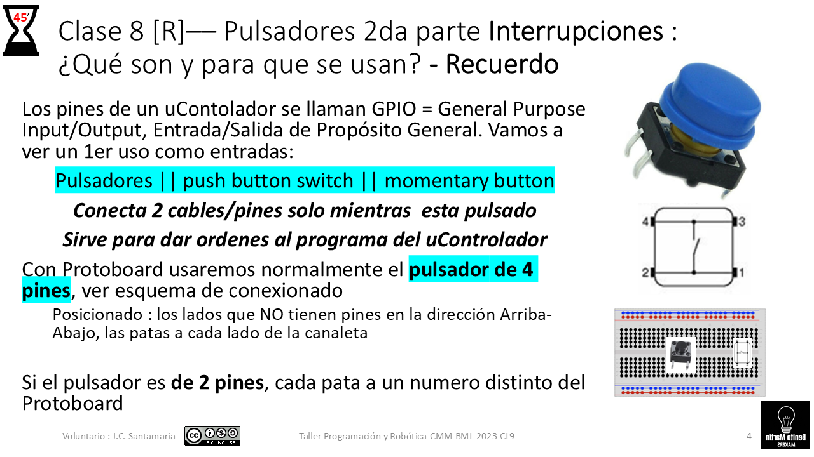
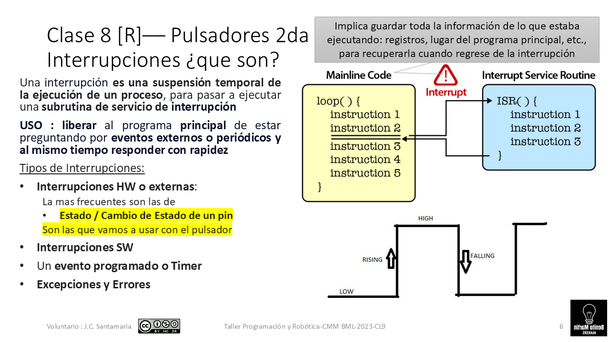
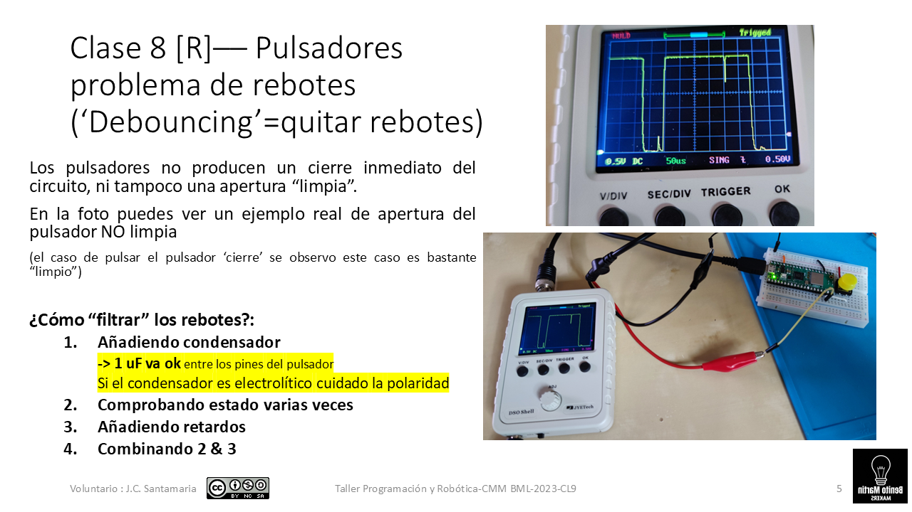
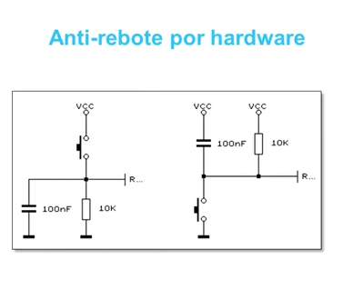

# CL5 - R Juego Tiempo Reaccion con LCD  x1 y x2 jugadores - Pulsadores y LCD

Indice evolutivo del las clases del taller + libros y webs de referencia:

[GitHub - Jcspoza/2526_PyR_Index: Curso Programación y Robotica 2025 2026 - CMM BML](https://github.com/Jcspoza/2526_PyR_Index)

## Clase 5 - Indice - 90 minutos

- Materiales y links a información

- Librerías importantes

- Propuesta de proyecto

- Plan de trabajo : prototipado en 2 Dimensiones 

- Aprender / Entender: pulsadores, interrupciones y medidas de tiempo

- Test Básico HW del LCD

- 1x Prueba de la Funcionalidad : Autonomía con batería Lipo/ powerbank

- 1x Funcionalidad: Tiempo de reacción con interrupciones: Prototipos Juego x1- SIN LCD

- 2x Funcionalidades: Tiempo de reacción con int. + Autonomía :Prototipos Juego x1- CON LCD

- 

- 2x Funcionalidades : T. de reacción con int. + 2 jugadores :Prototipos Juego x2- SIN LCD - por hacer

- 3x Funcionalidades : T. de reacción con int. + 2 jugadores + Autonomía :Prototipos Juego x2- SIN LCD - por hacer

- Tabla resumen de programas

- TO DO

## Materiales y links a informacion

| Material                                                                                                              | Descripcion                                                                                                                     | Kit SF |
| --------------------------------------------------------------------------------------------------------------------- | ------------------------------------------------------------------------------------------------------------------------------- |:------:|
| [Protoboard 400 o 700](https://docs.sunfounder.com/projects/kepler-kit/en/latest/component/component_breadboard.html) | Placa para prototipos ver apartado [Uso de la protoboard](https://github.com/Jcspoza/2526CL1_R_CircElect0#uso-de-la-protoboard) | SI     |
| [Cables dupond M-M](https://docs.sunfounder.com/projects/kepler-kit/en/latest/component/component_wire.html)          | Sirven para hacer conexiones en protoboard                                                                                      | SI     |
| [Led rojo](https://docs.sunfounder.com/projects/pico-2w-kit/en/latest/component/component_led.html)                   | Se usara para indicar comienzo de cuenta de Tiempo de reacción                                                                  | SI     |
| [Resistencia 220 ohm](https://docs.sunfounder.com/projects/pico-2w-kit/en/latest/component/component_resistor.html)   | Resistencia 220 ohm para limitar corriente de LED                                                                               | SI     |
| [Pulsador x2](https://docs.sunfounder.com/projects/pico-2w-kit/en/latest/component/component_button.html)             | Pulsador para protoboard, su pulsación indicará fin de tiempo de reacción                                                       | SI     |
| [Resistencia 10k ohm](https://docs.sunfounder.com/projects/pico-2w-kit/en/latest/component/component_resistor.html)   | Resistencia de 10 K ohm para pull-Down                                                                                          | SI     |
| [LCD i2c 16x2](https://docs.sunfounder.com/projects/pico-2w-kit/en/latest/component/component_i2clcd1602.html)        | Display LCD con comunicación i2c, de 2 líneas de 16 caracteres cada una                                                         | SI     |

### Link a Tutoriales / informacion

- El juego se basa en el capitulo 6 del libro 

[Libro 'Get started with MicroPython on Raspberry Pi Pico'](https://github.com/Jcspoza/2526_PyR_Index/blob/main/doc/upython_RPi_PiPico_Digital_v10.pdf) que esta disponible también en la pagina de indice

- Tutorial sobre uso del LCD : ver la clase del año 24-25 [2425CL5_LCD primeros pasos](https://github.com/Jcspoza/CMM_Python_uP_PicoW/tree/main/2425CL5_LCD1st)

-  Tutoriales sobre pulsadores e interrupciones : [Buttons - Learning MicroPython](https://dmccreary.github.io/learning-micropython/basics/03-button/)

### Librerías importantes

Para el **LCD** usaremos la libreria del usuario T-622

[GitHub - T-622/RPI-PICO-I2C-LCD: to allow usage of the PCF8574 I2C lcd backpack for either 20x4 or 16x2 lcd screens.](https://github.com/T-622/RPI-PICO-I2C-LCD)

mejor que la que trae el kit. Es algo mas versátil y de uso mas común

## Propuesta de Proyecto

Vamos a hacer el **Juego de Tiempo de Reacción humana ante un evento** siguiendo el tutorial del libro 'Get started ...' 

Para hacerlo mas 'real' , vamos a llegar a un **prototipo autónomo**, es decir que no necesitemos el PC ni la consola de Thonny para jugar. Por tanto, necesitamos: 

1. un display para mostrar informacion -> usaremos el del kit : LCD i2c 2x16 + la libreria T-622
2. queremos que todo el proyecto tenga alimentación independiente del PC

## Plan de trabajo : prototipado en 2 Dimensiones

Vamos a escribir en una tabla por un lado los requisitos HW y por otro lado las pruebas básicas + pruebas de aprendizaje + programas con funcionalidades requeridas

| Prueba/ Funcionalidad                                                                 | Alimentación independiente                      | LCD          | <u>Pulsador </u>: contar Pulsaciones                                  | Pulsador: Medir Tiempo usando interrupciones                       |
| ------------------------------------------------------------------------------------- | ----------------------------------------------- | ------------ | --------------------------------------------------------------------- | ------------------------------------------------------------------ |
| Pruebas de Aprendizaje                                                                |                                                 |              | Aprender / Entender pulsadores SIN interrupciones: contar pulsaciones |                                                                    |
| Pruebas de Aprendizaje                                                                |                                                 |              |                                                                       | Medir tiempo SIN interrupción:                                     |
| Pruebas de Aprendizaje                                                                |                                                 |              | Entender pulsadores CON interrupciones, contar pulsaciones            |                                                                    |
| Funcionalidad: Medir tiempo de reacción                                               |                                                 |              |                                                                       | Medir tiempo CON interrupciones                                    |
| Test básico                                                                           |                                                 | Bhwt del LCD |                                                                       |                                                                    |
| Funcionalidad : Autonomía                                                             | Ejecutar BHWT de LCD con 1.batería Lipo => FAIL |              |                                                                       |                                                                    |
| Funcionalidad : Autonomía                                                             | Ejecutar BHWT de LCD con 2. Power bank => OK    |              |                                                                       |                                                                    |
| Funcionalidad: Medir tiempo Reacción 1 jugador CON Interrupciones                     |                                                 |              | X                                                                     | Primeros prototipos Juego x1:  **JTReacX1_irq** :  v1.0, v2.0 v2.1 |
| Funcionalidades: Medir tiempo Reacción 1 jugador CON Interrupciones + LCD + powerbank | JTReacX1_irqLCD_1_0.py                          | X            | X                                                                     | X                                                                  |

## 

## Aprender / Entender: pulsadores, interrupciones y medidas de tiempo

### Breve explicación sobre pulsadores

Los pulsadores son **entradas digitales** que se usan para 3 propósitos:

1. **Cambiar el estado** de un dispositivo : ejemplo encender o apagar un led al pulsar

2. **Contar**: subir el volumen de un altavoz contando pulsaciones o la intensidad de un led

3. **Medir tiempos** entre pulsaciones

Normalmente se usan **pulsadores momentáneos,** es decir que vuelven a su estado al liberar la pulsación. Pero hay de otros tipos que cambian entre dos estados permaneciendo en el último.

El **principal problema de los pulsadores son los rebotes:** el circuito eléctrico no se cierra ni abre de forma limpia. Es un problema complejo de tratar por HW, por lo que se suelen usar retardos en el SW.

### Uso SIN interrupciones: contar pulsaciones

[R_2526CL5_PulsaScan_1_0.py](R_2526CL5_PulsaScan_1_0.py) : cuenta las veces que se ha pulsado un pulsador , establece un tiempo de espera de 1 segundo entre pulsaciones 

[R_2526CL5_PulsaScan_1_2.py](R_2526CL5_PulsaScan_1_2.py) : cuenta las veces que se ha pulsado un pulsador , establece un tiempo de espera de **personalizabl**e : recomendado 250 miliseg

### SIN interrupciones: medir Tiempo: **PulsaTime** v1.0

[R_2526CL5_PulsaTime_1_0.py](R_2526CL5_PulsaTime_1_0.py) : mide el tiempo de la primera pulsación, o tiempo de reacción justo cuando el led interno se apaga

#### Medir diferencias de tiempo en uC

<u>Cuidado </u>: la medida del tiempo con contadores limitados en cuanto a dígitos , puede producir restas con errores

### Breve explicación de interrupciones y Rebotes

#### Circuitos anti rebotes mas sencillos

### CON interrupciones: contar pulsaciones:

[R_2526CL5_PulsaScanIrq_2_0.py](R_2526CL5_PulsaScanIrq_2_0.py) : Usa interrupciones para **contar** pulsaciones - SIN anti- rebote por SW. ERROR

[R_2526CL5_PulsaScanIrq_3_0.py](R_2526CL5_PulsaScanIrq_3_0.py) : Usa interrupciones para **contar** pulsaciones - CON anti- rebote por SW de 200milisegundos

### CON interrupciones: medir Tiempo

[R_2526CL5_PulsaTimeIrq_1_0.py](R_2526CL5_PulsaTimeIrq_1_0.py): Usa interrupciones para **medir tiempo** - ERROR sigue midiendo tiempos.

[R_2526CL5_PulsaTimeIrq_2_0.py](R_2526CL5_PulsaTimeIrq_2_0.py): Usa interrupciones para **medir tiempo** - solo mide la primera vez. ==>**Su codigo sera la base del juego**

---

## Test Básico HW del LCD

En una rama paralela del nuestro trabajo en el proyecto vamos a usar el display LCD, sin entrar a dar muchas explicaciones. Ver tutorial sobre uso del LCD : ver la clase del año 24-25 [2425CL5_LCD primeros pasos](https://github.com/Jcspoza/CMM_Python_uP_PicoW/tree/main/2425CL5_LCD1st)

### Carga de las librerías

La libreria que usaremos esta dividida en 2 ficheros ( no es lo normal, es asi por razones históricas)

Hay que subir al directorio /lib de la Pico  / W / 2W

[lcd_api.py](lcd_api.py)

[pico_i2c_lcd.py](pico_i2c_lcd.py)

### Montaje HW

### Ejecutar el test básico del LCD

Al ejecutar 

[R_bhwt_lcd16x2_I2C.py](R_bhwt_lcd16x2_I2C.py)

Aparecerá un mensaje en las 2 líneas del display

---

## 1x Prueba de la Funcionalidad : Autonomía con batería Lipo/ powerbank

El componente mas demandante de potencia y voltaje es el LCD que de hecho puede no funcionar a 3.3 volt. Probamos a ejecutar el bhwt del LCD desconectado del PC

1. Pasar [R_bhwt_lcd16x2_I2C.py](R_bhwt_lcd16x2_I2C.py) -> main.py a al Pico

2. Conectar VCC del LCD a VSYS

3. Concetar bateria Lipo a VSYS y GND => FAIL en montaje de JCSP

4. ---------------------------------------

5. Re concetar VCC del LCD a +5volt del protoboard ( VBUS)

6. Conectar powerbank a concetor Pico => OK

Resultado: **el montaje necesita para funcionar de forma autónoma una Powerbank o equivalente que de 5volt a la entrada USB de la Pico**

---

## 1x Funcionalidad: Tiempo de reacción con interrupciones: Prototipos Juego x1- SIN LCD

[R_2526CL5_JTReacX1_irq_1_0.py](R_2526CL5_JTReacX1_irq_1_0.py) : copia del programa del libro con ajuste de GPIO´s- poco útil

[R_2526CL5_JTReacX1_irq_2_0.py](R_2526CL5_JTReacX1_irq_2_0.py) : Básicamente es el programa del libro con ajuste de GPIO´s y muchos comentarios útiles -> **Empezar estudio por aqui**

[R_2526CL5_JTReacX1_irq_2_1.py](R_2526CL5_JTReacX1_irq_2_1.py) : En vez de esperar 2 segundo a que acabe de reaccionar el jugador, usa la salida de la interrupción ( = una variable que modifica la interrupción)

## 2x Funcionalidades: Tiempo de reacción con int. + Autonomía :Prototipos Juego x1- CON LCD

[R_2526CL5_JTReacX1_irqLCD_1_0.py](R_2526CL5_JTReacX1_irqLCD_1_0.py) : basado en la versión 2.1 sin LCD, simplemente añade mensajes de salida en el LCD

---

## 2x Funcionalidades : T. de reacción con int. + 2 jugadores  :Prototipos Juego x2- SIN LCD - por hacer

## 3x Funcionalidades : T. de reacción con int. + 2 jugadores + Autonomía :Prototipos Juego x2- SIN LCD - por hacer

## Tabla resumen de programas

| Programa                                                             | Lenguaje | HW si Robotica y Notas                          | Objetivo de Aprendizaje                                                                                                    |
| -------------------------------------------------------------------- | -------- | ----------------------------------------------- | -------------------------------------------------------------------------------------------------------------------------- |
| [lcd_api.py](lcd_api.py)                                             | uPy      | instalar en /lib en la Pico                     | Librerías para el LCD                                                                                                      |
| [pico_i2c_lcd.py](pico_i2c_lcd.py)                                   | uPy      | instalar en /lib en la Pico                     |                                                                                                                            |
| [R_bhwt_lcd16x2_I2C.py](R_bhwt_lcd16x2_I2C.py)                       | uPy      | SDA -> GPIO4 / SCL -> GPIO5 / GND / VCC a+5volt | Test basico HW del LCD i2c                                                                                                 |
| [R_2526CL5_PulsaScan_1_2.py](R_2526CL5_PulsaScan_1_2.py)             | uPy      | pulsador -> GPIO15/ Led interno                 | Aprendizaje de uso de pulsadores <u>SIN interrupciones</u>- Aucción  **contar**                                            |
| [R_2526CL5_PulsaTime_1_0.py](R_2526CL5_PulsaTime_1_0.py) :           | uPy      | pulsador -> GPIO15/ Led interno                 | Aprendizaje de uso de pulsadores <u>SIN interrupciones</u>- Aucción  **Medir Tiempo**                                      |
| [R_2526CL5_PulsaScanIrq_2_0.py](R_2526CL5_PulsaScanIrq_2_0.py)       | uPy      | pulsador -> GPIO15/ Led interno                 | Aprendizaje de uso de pulsadores <u>CON interrupciones</u>- Aucción  **contar**                                            |
| [R_2526CL5_PulsaTimeIrq_2_0.py](R_2526CL5_PulsaTimeIrq_2_0.py)       | uPy      | pulsador -> GPIO15/ Led interno                 | Aprendizaje de uso de pulsadores <u>CON interrupciones</u>- Aucción  **Medir Tiempo**/ ==>Su codigo será la base del juego |
| [R_2526CL5_JTReacX1_irq_2_0.py](R_2526CL5_JTReacX1_irq_2_0.py)       |          | pulsador -> GPIO15/ Led GPIO16                  | Prototipo Juego x1- SIN LCD                                                                                                |
| [R_2526CL5_JTReacX1_irq_2_1.py](R_2526CL5_JTReacX1_irq_2_1.py)       |          | pulsador -> GPIO15/ Led GPIO16                  | Prototipo Juego x1- SIN LCD - Versión OK                                                                                   |
| [R_2526CL5_JTReacX1_irqLCD_1_0.py](R_2526CL5_JTReacX1_irqLCD_1_0.py) |          | pulsador -> GPIO15/ Led GPIO16 / LCD GPIOS4 y 5 | Prototipo Juego x1- CON LCD                                                                                                |

---

## TO DO :

- **Ampliar el Juego a 2 jugadores**
